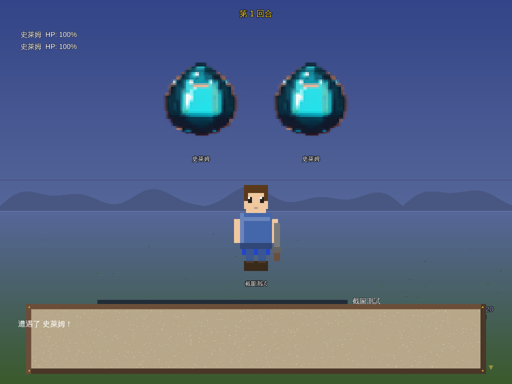
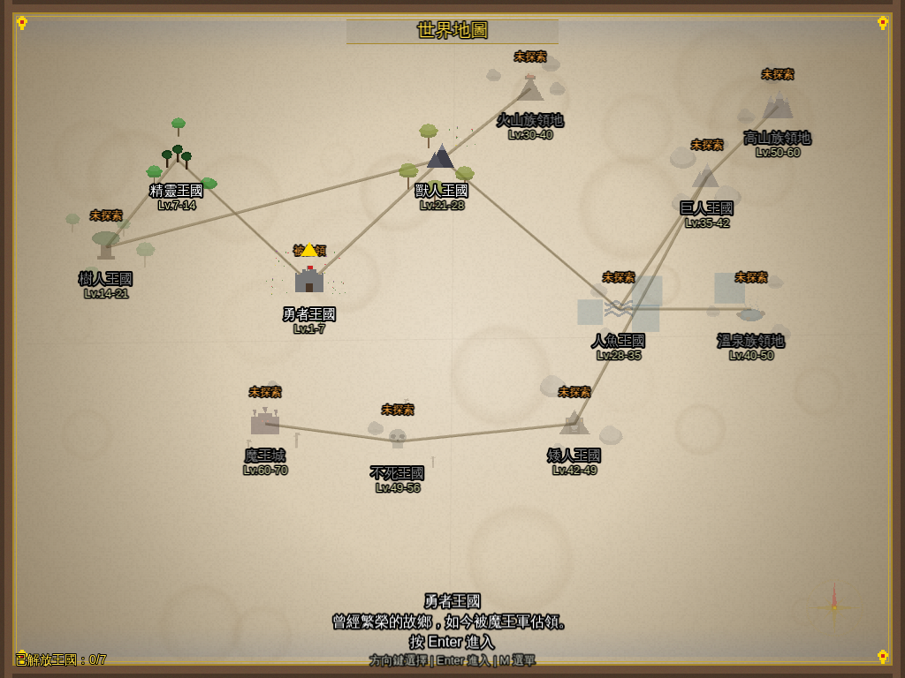
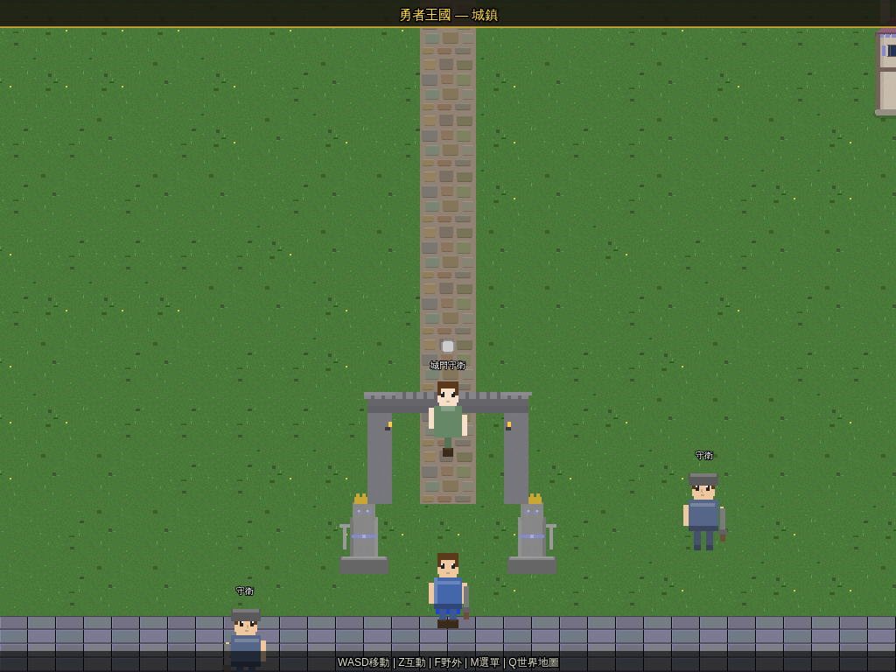

# 勇者傳說 — 七國的傳說

> 一款以 Phaser 3 打造的 2D 像素風 JRPG，AI + 程式生成美術、回合制戰鬥、12 大區域冒險。

[](https://github.com/osisdie/phaser-rpg-game/actions/workflows/ci.yml)
[](LICENSE)

<p align="center">
  
  
</p>

---

## 遊戲特色 Features

- **壯闊的冒險旅程** — 歷經 12 個王國（精靈、樹人、獸人、人魚、巨人、矮人、不死族…），從流浪勇者成長為國王
- **回合制戰鬥** — 基於敏捷排序，支援攻擊、技能、道具、防禦、逃跑
- **120+ 怪物 & 12 Boss** — 每個區域 10 種怪物 + 1 位區域魔王，最終迎戰大魔王
- **7 位夥伴** — 各具種族特色技能，最多帶 3 位上場戰鬥
- **AI + 程式生成美術** — 怪物由 Stable Diffusion 生成像素風精靈；角色、建築、地形、UI 面板由 Canvas 2D 即時繪製，AI 優先、程式生成備援
- **AI 音效** — MusicGen 生成背景音樂與音效
- **裝備系統** — 5 部位 × 8 階裝備，影響攻防敏等屬性
- **存檔系統** — 3 個手動存檔 + 自動存檔（localStorage）
- **選單系統** — 物品 / 裝備 / 隊伍 / 技能 / 存檔 / 系統

## 遊戲截圖 Screenshots

| 標題畫面 | 世界地圖 |
|:---:|:---:|
|  |  |

| 城鎮探索 | 戰鬥場景 |
|:---:|:---:|
|  |  |

## Tech Stack

| Technology | Purpose |
|---|---|
| [Phaser 3](https://phaser.io/) | 2D game framework (WebGL / Canvas) |
| [TypeScript](https://www.typescriptlang.org/) | Type-safe game logic |
| [Vite](https://vitejs.dev/) | Dev server & bundler |
| [Playwright](https://playwright.dev/) | E2E browser testing |
| [Stable Diffusion](https://huggingface.co/) | AI pixel-art sprite generation (All-In-One-Pixel-Model) |
| [MusicGen](https://huggingface.co/facebook/musicgen-small) | AI background music & SFX generation |

## Getting Started

### Prerequisites

- [Node.js](https://nodejs.org/) >= 20
- [pnpm](https://pnpm.io/) >= 9

### Installation

```bash
git clone https://github.com/osisdie/phaser-rpg-game.git
cd phaser-rpg-game
pnpm install
```

### Run

```bash
pnpm start          # Start dev server (port 5473)
pnpm run status     # Check if server is running
pnpm run stop       # Stop the server
```

Or run directly:

```bash
pnpm run dev        # Vite dev server
pnpm run build      # TypeScript check + production build
pnpm run preview    # Preview production build
```

## Project Structure

```
phaser-rpg-game/
├── src/
│   ├── scenes/        # Phaser scenes (Boot → Title → NameInput → WorldMap → Town/Field → Battle → …)
│   ├── systems/       # Game logic (state, combat, audio, i18n)
│   ├── entities/      # Player sprite & movement
│   ├── data/          # Static data (monsters, items, skills, regions, tables)
│   ├── ui/            # Reusable UI components (TextBox, BattleHUD, menus)
│   ├── maps/          # Procedural map generation (town 40×32, field 48×36)
│   ├── art/           # Procedural pixel art generation (Canvas 2D)
│   └── types/         # TypeScript interfaces
├── e2e/               # Playwright E2E tests
├── scripts/           # Dev workflow & AI asset generation scripts
├── public/assets/ai/  # AI-generated sprites, audio & manifests
├── docs/screenshots/  # Game screenshots
├── playwright.config.ts
├── index.html
├── vite.config.ts
└── tsconfig.json
```

## Scripts

| Command | Description |
|---|---|
| `pnpm start` | Start dev server with port-check |
| `pnpm run stop` | Stop dev server on port 5473 |
| `pnpm run status` | Check server status + health check |
| `pnpm run dev` | Vite dev server (raw) |
| `pnpm run build` | TypeScript check + Vite build |
| `pnpm run preview` | Preview production build |
| `pnpm test` | Run Playwright E2E tests |
| `pnpm run test:ui` | Open Playwright test UI |
| `bash scripts/build.sh` | TypeScript check + build with output |

## Contributing

Contributions are welcome! Follow these steps:

1. **Fork** the repository
2. **Create a branch**: `git checkout -b feat/my-feature`
3. **Commit** using [Conventional Commits](https://www.conventionalcommits.org/):
   ```bash
   git commit -m "feat: add new monster sprites"
   ```
4. **Push** and open a **Pull Request**

### Setup pre-commit hooks

```bash
pip install pre-commit
pre-commit install
pre-commit install --hook-type commit-msg
```

This enforces:
- Trailing whitespace / line ending fixes
- Case-conflict checks (important for WSL / Windows)
- TypeScript type checking
- Conventional commit messages

## License

[MIT](LICENSE) — feel free to use, modify, and distribute.
