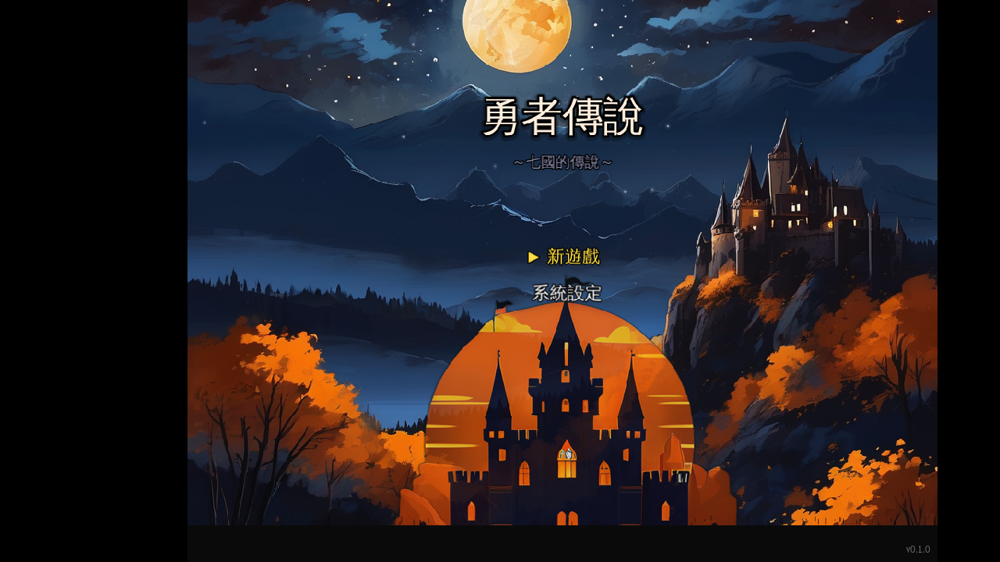
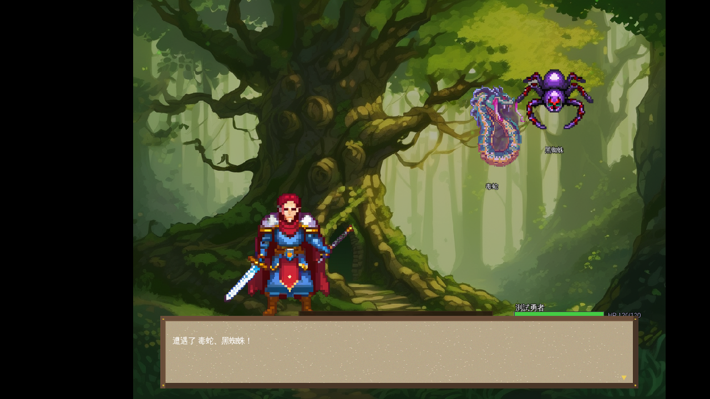
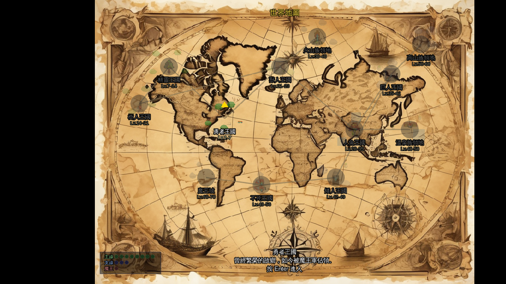
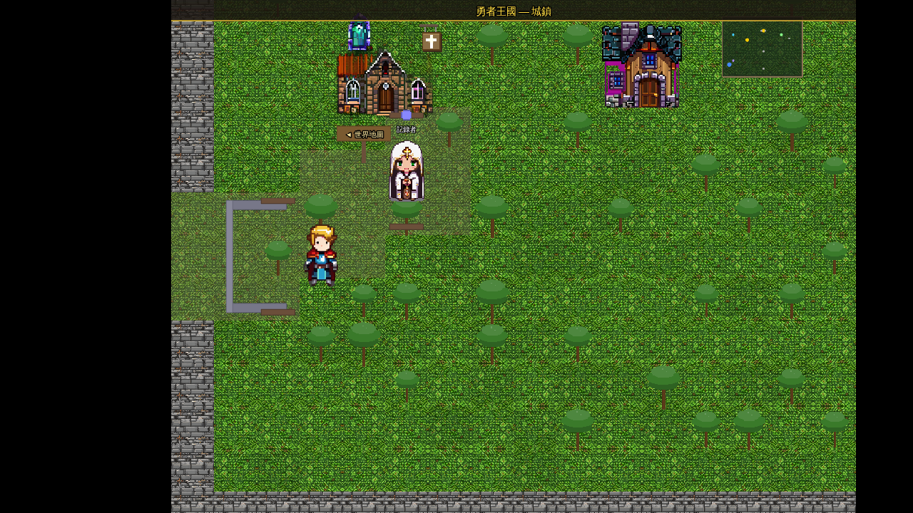
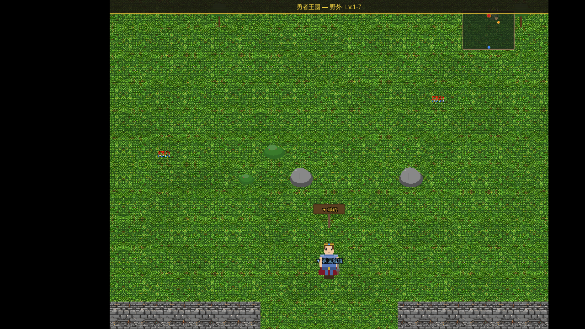
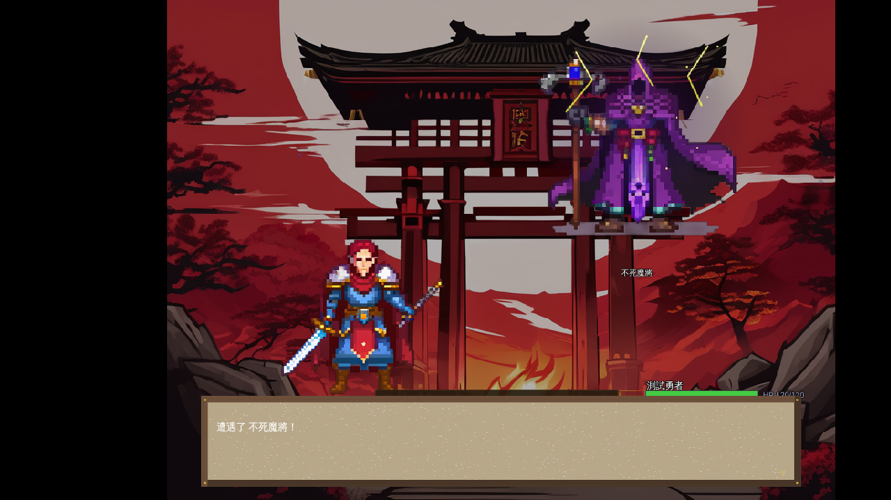

# 勇者傳說 — 七國的傳說

> 一款以 Phaser 3 打造的 2D 像素風 JRPG，AI + 程式生成美術、回合制戰鬥、12 大區域冒險。

[English](README.md) | 繁體中文

[](https://osisdie.github.io/phaser-rpg-game/)
[](https://github.com/osisdie/phaser-rpg-game/actions/workflows/ci.yml)
[](LICENSE)
[](https://phaser.io/)
[](https://www.typescriptlang.org/)

<p align="center">
  
  
</p>

---

## 遊戲特色

- **壯闊的冒險旅程** — 歷經 12 個王國（精靈、樹人、獸人、人魚、巨人、矮人、不死族…），從流浪勇者成長為國王
- **回合制戰鬥** — 基於敏捷排序，支援攻擊、技能、道具、防禦、逃跑
- **120+ 怪物 & 12 Boss** — 每個區域 10 種怪物 + 1 位區域魔王，最終迎戰大魔王
- **7 位夥伴** — 各具種族特色技能，最多帶 3 位上場戰鬥
- **AI + 程式生成美術** — 怪物由 Stable Diffusion 生成像素風精靈；角色、建築、地形、UI 面板由 Canvas 2D 即時繪製，AI 優先、程式生成備援
- **AI 音效** — MusicGen 生成背景音樂與音效
- **裝備系統** — 5 部位 × 8 階裝備，影響攻防敏等屬性
- **存檔系統** — 3 個手動存檔 + 自動存檔（localStorage）
- **選單系統** — 物品 / 裝備 / 隊伍 / 技能 / 存檔 / 系統

## 操作說明

| 按鍵 | 功能 |
|------|------|
| `WASD` / `方向鍵` | 移動 |
| `Enter` / `Space` / `Z` | 確認 / 對話推進 |
| `ESC` | 選單 / 取消 |
| `A` | 戰鬥自動攻擊模式 |
| `F11` | 全螢幕切換 |
| 滑鼠點擊 | 確認 / 選擇目標 |
| 右鍵 | 取消 |

## 遊戲截圖

| 標題畫面 | 世界地圖 |
|:---:|:---:|
|  |  |

| 城鎮探索 | 野外冒險 |
|:---:|:---:|
|  |  |

| 戰鬥場景 | Boss 戰 |
|:---:|:---:|
|  |  |

## 技術棧

| 技術 | 用途 |
|---|---|
| [Phaser 3](https://phaser.io/) | 2D 遊戲框架 (WebGL / Canvas) |
| [TypeScript](https://www.typescriptlang.org/) | 型別安全的遊戲邏輯 |
| [Vite](https://vitejs.dev/) | 開發伺服器與打包工具 |
| [Playwright](https://playwright.dev/) | E2E 瀏覽器測試 |
| [Stable Diffusion](https://huggingface.co/) | AI 像素風精靈生成 (All-In-One-Pixel-Model) |
| [MusicGen](https://huggingface.co/facebook/musicgen-small) | AI 背景音樂與音效生成 |

## 快速開始

### 前置需求

- [Node.js](https://nodejs.org/) >= 20
- [pnpm](https://pnpm.io/) >= 9

### 安裝

```bash
git clone https://github.com/osisdie/phaser-rpg-game.git
cd phaser-rpg-game
pnpm install
```

### 執行

```bash
pnpm start          # 啟動開發伺服器 (port 5473)
pnpm run status     # 檢查伺服器狀態
pnpm run stop       # 停止伺服器
```

或直接執行：

```bash
pnpm run dev        # Vite 開發伺服器
pnpm run build      # TypeScript 檢查 + 正式建置
pnpm run preview    # 預覽正式建置結果
```

## 專案結構

```
phaser-rpg-game/
├── src/
│   ├── scenes/        # Phaser 場景 (Boot → Title → NameInput → WorldMap → Town/Field → Battle → …)
│   ├── systems/       # 遊戲邏輯 (狀態、戰鬥、音效、i18n)
│   ├── entities/      # 玩家精靈與移動
│   ├── data/          # 靜態資料 (怪物、道具、技能、區域、對話表)
│   ├── ui/            # 可重用 UI 元件 (TextBox、BattleHUD、選單)
│   ├── maps/          # 程式生成地圖 (城鎮 40×32、野外 48×36)
│   ├── art/           # 程式生成像素美術 (Canvas 2D)
│   └── types/         # TypeScript 介面
├── e2e/               # Playwright E2E 測試
├── scripts/           # 開發工具與 AI 素材生成腳本
├── public/assets/ai/  # AI 生成的精靈圖、音效與清單
├── docs/screenshots/  # 遊戲截圖
├── playwright.config.ts
├── index.html
├── vite.config.ts
└── tsconfig.json
```

## 指令

| 指令 | 說明 |
|---|---|
| `pnpm start` | 啟動開發伺服器（含 port 檢查） |
| `pnpm run stop` | 停止 port 5473 上的開發伺服器 |
| `pnpm run status` | 檢查伺服器狀態 + 健康檢查 |
| `pnpm run dev` | Vite 開發伺服器（原始） |
| `pnpm run build` | TypeScript 檢查 + Vite 建置 |
| `pnpm run preview` | 預覽正式建置結果 |
| `pnpm test` | 執行 Playwright E2E 測試 |
| `pnpm run test:ui` | 開啟 Playwright 測試 UI |
| `pnpm run capture:screenshots` | 擷取 README 截圖 |
| `bash scripts/build.sh` | TypeScript 檢查 + 建置（含輸出） |

## 貢獻

歡迎貢獻！請參閱 [CONTRIBUTING.md](CONTRIBUTING.md) 了解完整指南。

簡要流程：

1. **Fork** 此 repo
2. **建立分支**：`git checkout -b feat/my-feature`
3. 使用 [Conventional Commits](https://www.conventionalcommits.org/) **提交**：
   ```bash
   git commit -m "feat: add new monster sprites"
   ```
4. **Push** 並開啟 **Pull Request**

## 授權

[MIT](LICENSE) — 程式碼以 MIT 授權；歡迎使用、修改與散佈。**注意：**`public/assets/ai/` 中的 AI 生成素材可能受其他授權條款約束（見下方 [AI 生成素材聲明](#ai-生成素材聲明)）。

### AI 生成素材聲明

`public/assets/ai/` 中的素材（精靈圖、音效等）使用第三方 AI 模型生成，可能受 MIT 以外的授權條款約束：

| 素材類型 | 模型 / 來源 | 授權 |
|----------|-------------|------|
| 像素風精靈圖 | [All-In-One-Pixel-Model](https://huggingface.co/) (Stable Diffusion) | 請查看 Hugging Face 上的模型卡 |
| 背景音樂與音效 | [MusicGen](https://huggingface.co/facebook/musicgen-small) | [Meta 授權](https://github.com/facebookresearch/audiocraft/blob/main/LICENSE) |

**使用者有責任遵守所有適用的授權條款**。MIT 授權僅適用於程式碼；AI 素材可能有不同條款。
